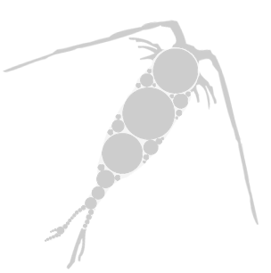

### <div style="clear: both;">  <font size= “1”>The Pelagic Size Structure database ([PSSdb](https://pssdb.net/ ""))</font></div>  
###### Jessica Luo, Rainer Kiko, Marco Corrales-Ugalde, Mathilde Dugenne, Todd O'Brien, Charles Stock, Jean-Olivier Irisson, Lars Stemmann, Fabien Lombard
<a href="mailto:contact@pssdb.net">Contact us</a>


We are developing the Pelagic Size Structure database to provide globally consistent datasets of living and non-living particle size distributions obtained from marine imaging devices.

The objectives for PSSdb are:

1. provide multi-level, harmonized products of plankton size structure of increasing taxonomic resolution, matching the spatio-temporal resolution of current biogeochemical models.
NOTE:  the latest PSSdb data products can be downloaded [here](https://pssdb.net/ ""), which includes the full list of data providers.


2. implement a workflow able to retrieve count, size, and taxonomic information from online imaging data streams.
This GitHub repository contain all the scripts and datafiles generated by PSSdb workflow. See installation instructions below


Acknowledgment: This work is funded by NOAA (Award #NA21OAR4310254)
<details name="installation">
  <summary>Installation</summary>
<font size="2">
Disclaimer: these instructions are for users that want to run or contribute to the workflow. To install this GitHub repository on a local computer, open a terminal window and type:
</font>
>>>>>>> main

```
  cd ~
  mkdir GIT
  cd ~/GIT
  git clone https://github.com/jessluo/PSSdb.git
```
<font size="2">
This repository can be fully configured according to the information saved in the <a href="https://github.com/jessluo/PSSdb/blob/main/scripts/configuration_masterfile.yaml"><span class="link"></span>configuration masterfile</a> (see <a href="#organisation"><span class="link"></span>Organisation</a> tab below) and tuned to the spatio-temporal resolution of interest depending on the research question.
A protected configuration masterfile, containing password and login infromation, is also necessary to download datasets from EcoTaxa/EcoPart. Follow the instructions in the <a href="#organisation"><span class="link"></span>Organisation</a> tab below.
</font>
</details>


<div id="organisation">
<details>
  <summary>Organisation</summary>
<font size="2">
This repository contains a:

* <a href="https://github.com/jessluo/PSSdb/blob/main/scripts/configuration_masterfile.yaml"><span class="link"></span>configuration masterfile</a>: File used to configure PSSdb GitHub repository.
This file contains the information related to specific path setup for data storage (folder <a href="https://github.com/jessluo/PSSdb/blob/main/raw"><span class="link"></span>raw</a> and associated subfolders generated after specific steps, see PSSdb [Workflow](#workflow)).
In addition,the file also include the parameters specifying the spatio-temporal resolution used to generate PSSdb current data products. These parameters can thus be tuned in order to answer a specific research question requiring a different resolution.

<font size="2">
Attention: The repository includes a <a href="https://github.com/jessluo/PSSdb/blob/main/.gitignore"><span class="link"></span>gitignore file</a>, which is used to protect personal information, as well as raw datasets, or datafiles that exceed the limit for GitHub upload (2Gb). Personal information, login and password, are required to download datasets hosted on <a href="https://ecotaxa.obs-vlfr.fr"><span class="link"></span>EcoTaxa</a> or <a href="https://ecopart.obs-vlfr.fr"><span class="link"></span>EcoPart</a>. 
Read instructions on l.1-4 of the configuration masterfile to save these protected information in a "configuration_masterfile_pw.yaml" file.
</font>

* <a href="https://github.com/jessluo/PSSdb/blob/main/scripts"><span class="link"></span>scripts</a> section: contains all scripts and functions developed for PSSdb. This section includes a function (named _funcs_xxx.py_) specific to each step of the [Workflow](#workflow), paired with a numbered script of the same name (_[0:4]__xxx.py_), whose objective is to loop through all the available datasets.
Numbered scripts should be run sequentially in order to generate the intermediate and final PSSdb data products. When ran for the first time, the numbered script will automatically save a readme file, describing the datafiles that have been generated. Alternatively, the function files may be run directly to perform a given step for a single dataset. 


* <a href="https://github.com/jessluo/PSSdb/blob/main/raw"><span class="link"></span>raw</a> section: contains all datafiles, including the raw, intermediate, and final PSSdb data products, under specific sub-folders named after the configuration masterfile.
In addition, this folder also includes the <a href="https://github.com/jessluo/PSSdb/blob/main/raw/project_list_all.xlsx"><span class="link"></span>full list of available datasets</a>, as well as instrument-specific "standardizer" spreadsheets (see [instructions here](#standardizer)), generated by step 0. The former spreadsheet is separated by tab, listing specific datasets hosted on a given online data stream used in PSSdb (e.g. EcoTaxa. EcoPart, IFCb dashboards). The readme tab is used to describe the columns generated for each list, such as the dataset ID, the data source url, the provider name and email, the total number of images and their classification/validation percentages, and the number of flagged samples resulting from the dataset QC.
The size bins used to compute the size spectra for PSSdb, according to EcoPart outputs, are also stored in the <a href="https://github.com/jessluo/PSSdb/blob/main/raw/ecopart_size_bins.tsv"><span class="link"></span>size bins file</a>, to allow for user-specific tuning of PSSdb data products.


* reports section: contains all interactive reports generated by PSSdb control quality check. This section is included in the <a href="https://github.com/jessluo/PSSdb/blob/main/.gitignore"><span class="link"></span>gitignore file</a>, since reports exceed GitHub size limit, and therefore does not appear online. See [Workflow](#workflow) control quality for a detailed description of the objective and [FAQ](#faq) for usage of PSSdb QC reports.


* <a href="https://github.com/jessluo/PSSdb/blob/main/figures"><span class="link"></span>figures</a> section: contains all figures generated to check the control quality, standardization, or NBSS computation for PSSdb datasets. Figures generated for PSSdb papers are stored in specific sub-folder, named after each paper.


* <a href="https://github.com/jessluo/PSSdb/blob/main/ancillary"><span class="link"></span>ancillary</a> section: contains the <a href="https://github.com/jessluo/PSSdb/blob/main/ancillary/plankton_annotated_taxonomy.xlsx"><span class="link"></span>taxonomic</a> and <a href="https://github.com/jessluo/PSSdb/blob/main/ancillary/plankton_elemental_quotas.xlsx"><span class="link"></span>elemental quotas</a> look-up tables, used to generate PSSdb taxonomy-resolving future data products.
</font>
</details>

</div>

<div id="workflow">


<details>
  <summary>Workflow</summary>
<font size="2" style="line-height:0.2em">
<br>Currently, we use imaging datasets that can be extracted from online data streams, to follow the FAIR (Findable, Accessible, Interoperable, Reproducible) guidelines. 
Datasets are generated by the Imaging FlowCytobot (IFCb), capturing the size distributions of 4-100 &mu;m autofluorescing organisms, the Underwater Vision Profiler (UVP), detecting living and detrital particles between 150-20,000 &mu;m, and scanners like the ZooScan, which complement the analysis of zooplankton (excluding fragile taxa) through net collections.
</font>

<details>
  <summary>Acquisition and pre-processing of imaging datasets prior to PSSdb ingestion</summary><blockquote>
<font size="2">
The acquisition and pre-processing steps of imaging datasets prior PSSdb ingestion is illustrated below.

Imaging sensors are deployed on various platforms/water-supply modes, including research vessel's flowthrough water supply and mooring stations for IFCb, floats/gliders or CTD rosette for UVP, and plankton nets for ZooScan. <br><br> Images are segmented (i.e the process of detouring individual region of interests from the background frame) and masks are generated to extract morphometric features in real-time for UVP deployments, or after the acquisition.<br><br> Automated classifiers are trained on features or directly on raw pictures, in the case of CNN. <br><br> Metadata, including samples/profiles GPS coordinates, timestamp and depth, are filled in before or after the image acquisition.<br><br> Resulting tables are uploaded to online data streams, and can be extracted using API (IFCb dashboards, EcoTaxa) or custom web-scraping scripts (EcoPart). 
</font>

<div>
<p style='padding:-0.1em;line-height:1.0em; margin-left:0.7em; display: inline-block;'>


<br><br><br><br><br><br>

</p>
</div>
</blockquote></details>


<font size="2">
<br>PSSdb data pipeline first extract the raw datasets from the online data streams presented above. Disclaimer: data download takes time and requires permission from data owners.
</font>

<details>
  <summary>Listing and downloading imaging datasets</summary><blockquote>
<font size="2">
<br>
We rely primarily on online, accessible, platforms created by the instrument developers to manage their imaging datasets: 

* IFCb dashboards (of generation 2 exclusively, as generation 1 dashboards do not include metadata like longitude and latitude) 
* Ecotaxa/EcoPart, initially developed for ZooScan and UVP users.

We used the application programming interface (or API) developed for IFCb dashboards and EcoTaxa, and custom scripts for EcoPart, to (1) list and (2) access these datasets. 
1. The full <a href="https://github.com/jessluo/PSSdb/blob/main/raw/project_list_all.xslx"><span class="link"></span>list</a> of datasets hosted on these online data streams is generated through the <a href="https://github.com/jessluo/PSSdb/blob/main/scripts/0_list_projects.py"><span class="link"></span>listing script</a>. This scripts uses a set of functions defined in the <a href="https://github.com/jessluo/PSSdb/blob/main/scripts/funcs_list_projects.py"><span class="link"></span>listing functions</a> file, for each data source (EcoTaxa, EcoPart, and IFCb dashboards). These functions list all the available datasets and also identify accessible ones on EcoTaxa/EcoPart based on login info stored in the configuration masterfile password file (see [instructions](#organisation) and  "PSSdb_access" column in the list of datasets).<br><br> To run on terminal:<br>
```python ~/GIT/PSSdb/scripts/0_list_projects.py```


2. All accessible datasets are extracted from their online data stream using the <a href="https://github.com/jessluo/PSSdb/blob/main/scripts/1_export_projects.py"><span class="link"></span>extraction script</a>, except for those hosted on IFCb dashboards that do not include all the datafiles ("features" and "autoclass" files) required for their ingestion in PSSdb, and for EcoPart datasets that do not have a corresponding project on EcoTaxa. Specific functions were defined in the <a href="https://github.com/jessluo/PSSdb/blob/main/scripts/funcs_export_projects.py"><span class="link"></span>extraction functions</a> file to extract a dataset from EcoTaxa, EcoPart, or IFCb dashboards. The default export option was selected for EcoTaxa datasets, while for EcoPart, we used the alternative "raw" export option, in order to retrieve the size, abundance, and taxonomic annotation of all particles without loosing any information (see the [FAQ](#faq) for more explanations).<br><br> The function file can be run as a script to export a single via the terminal: <br>```python ~/GIT/PSSdb/scripts/funcs_export_projects.py``` <br>To loop through the test set or all the accessible datasets, open terminal and type:<br> ```python ~/GIT/PSSdb/scripts/1_export_projects.py```. NOTE: this step contains several queries to ensure the user downloads just the necessary data. Do not download all the IFCB data (takes up to two weeks) and can put contrains on the data transfer of the IFCB servers. First contact Clarissa Anderson and/or Heidi Sosik before downloading data from the CALOOS dashboard or the WHOI dashboard respectively.


<div>
<p style='padding:-0.1em;line-height:1.0em; margin-left:0.7em; display: inline-block;'>

<font size="1">
</font>
</p>
</div>

</blockquote></details>

<font size="2">
<br>After extraction, raw datasets are consolidated (UVP datasets only), and pass through a standardization and control quality check. 

<details>
  <summary>Consolidation of EcoPart/EcoTaxa UVP datasets</summary><blockquote>
<font size="2">Most UVP datasets are uploaded on both EcoTaxa (for particles larger than the vignetting threshold) and EcoPart, which include all particles size and count info processed in real-time. Since EcoTaxa API does not provide the id of corresponding datasets on EcoPart, we used the custom function developed to list datasets on EcoPart to match-up corresponding datasets.
Matched-up datafiles are consolidated in a single table, whose format is most similar to the EcoPart "raw" export table:<br><br>  First, only small particles whose size is smaller than the vignetting threshold are selected from the EcoPart "raw" tables, to avoid accounting for the same particle twice.These particles are assigned a null taxonomic annotation and the "unclassified" status.<br><br>  Then, EcoTaxa table is binned according to EcoPArt depth/time bins, and appended to the consolidated table with a "nbr" of 1.
The consolidation function can be found <a href="https://github.com/jessluo/PSSdb/blob/main/scripts/funcs_consolidate_UVP_files.py"><span class="link"></span>here</a>. All UVP datasets are consolidated by running the <a href="https://github.com/jessluo/PSSdb/blob/main/scripts/2_standardize_projects.py"><span class="link"></span>script</a>:

```
python ~/GIT/PSSdb/scripts/2_standardize_projects.py
```

</font>
<div>
<p style='padding:-0.1em;line-height:1.0em; margin-left:0.7em; display: inline-block;'>


<br><br>
<font size="2">

</font>
</p>
</div>


</blockquote></details>

<details>
  <summary>Standardization and control quality check</summary><blockquote>
<font size="2">
Since the native format (header and units/formats) of most datasets vary based on the instrument, the pre-processing steps, or even the variable considered, we built "standardizer" spreadsheets to map the variable required for PSSdb ingestion. Instrument-specific spreadsheet can be found at: <a href="https://github.com/jessluo/PSSdb/blob/main/raw/project_IFCB_standardizer.xlsx"><span class="link"></span>IFCB</a>, <a href="https://github.com/jessluo/PSSdb/blob/main/raw/project_UVP_standardizer.xlsx"><span class="link"></span>UVP</a>, <a href="https://github.com/jessluo/PSSdb/blob/main/raw/project_Zooscan_standardizer.xlsx"><span class="link"></span>ZooScan</a>.
Consolidated tables are standardized according to the "Standardizers" spreadsheets automatically generated during the creation of the datasets list.<br><br> Prior to standardization and QC, these spreadsheets should be filled to map the native variable name (xxx_field) and unit (xxx_unit). All names and units will be standardized and harmonized to produce standardized tables, whose format will be unique, for the rest of the pipeline (see <a href="#faq"><span class="link"></span>FAQ</a>).<br><br> To ensure the good quality of the datasets ingested in PSSdb, samples pass through PSSdb QC, which check for 7 criteria:

1. GPS coordinates on landbased of the georeferenced <a href="https://www.marineregions.org/downloads.php"><span class="link"></span>Global Oceans and Seas</a> datasets.
2. Dubious GPS coordinates located at 0x0$`^\degree`$
3. Missing metadata/data required for the ingestion in PSSdb
4. Low ROI count per sample yielding an uncertainty in particle abundance >5% according to the Poisson statistical distribution
5. High percentage of artefacts (>20%)
6. Low (<95%) validation of taxonomic annotations for UVP and ZooScan datasets.
7. Multiple pixel size calibration factors

<br>  Samples are assigned a flag (1 for flagged samples, 0 otherwise) as they pass through PSSdb QC. Interactive reports (see <a href="#faq"><span class="link"></span>FAQ</a>) provide an overview of the QC and are sent to data providers to inform them of the number of samples that are excluded from the database.
Individual flags can be overruled at the demand of the data providers if they deem the sample can be ingested in PSSdb.

The standardization and QC functions can be found <a href="https://github.com/jessluo/PSSdb/blob/main/scripts/funcs_standardize_projects.py"><span class="link"></span>here</a>. All datasets are standardized and QCed by running this <a href="https://github.com/jessluo/PSSdb/blob/main/scripts/2_standardize_projects.py"><span class="link"></span>script</a>:

```
python ~/GIT/PSSdb/scripts/2_standardize_projects.py
```

</font>

<div>
<p style='padding:-0.1em;line-height:1.0em; margin-left:0.7em; display: inline-block;'>
<font size="2"></font>

<br><br>
</p>
</div>


</blockquote></details>


Standardized datasets are then binned according to <a href="https://github.com/jessluo/PSSdb/blob/main/raw/ecopart_size_bins.tsv"><span class="link"></span>EcoPart size classes</a>, 1x1$`^{\degree}`$ latitude and longitude grid cells, and year month,
to compute the Normalized Biovolume Size Spectrum and derived parameters (slope and intercept) according to Eqs (1&2):

(1) NB$`_i`$ = $`\sum_{i}`$Biovolume/volume imaged/size bin$`_i`$ width

(2) ln(NB$`_i`$)=slope x ln(size bin$`_i`$) + intercept


<details>
  <summary>Binning of standardized datasets</summary><blockquote>
<font size="2">Size bins are assigned to individual biovolume estimates, derived from ROI area. We selected this metric, rather than assuming ellipsoidal shape or using the biovolume distance-map estimates for IFCb datasets, in order to compute size spectra consistently across instruments and avoid biased estimates (see <a href="https://aslopubs.onlinelibrary.wiley.com/doi/full/10.1002/lom3.10492"><span class="link"></span>Dubois et al. (2022)</a>).
<br><br>Artefacts are further discarded to ensure that size spectra are representative of living and non-living particles, rather than methodological or processing biases. Note that samples with less than 95% validation of the taxonomic annotation were discarded for Zooscan and UVP projects, but not for IFCB projects, whose annotations are predictions-only. Thus, IFCB observations may include artifacts that were not classified as such, or exclude plankton that were classified as artifacts. 
<br><br>Spatio-temporal bins are also appended to standardized tables according to samples latitude, longitude, and timestamp.
</font>

The binning functions, which depend on the spatio-temporal resolution fixed parameters stored in the <a href="https://github.com/jessluo/PSSdb/blob/main/scripts/configuration_masterfile.yaml"><span class="link"></span>configuration masterfile</a>, can be found <a href="https://github.com/jessluo/PSSdb/blob/main/scripts/funcs_gridding.py"><span class="link"></span>here</a>. All datasets are gridded by running the <a href="https://github.com/jessluo/PSSdb/blob/main/scripts/3_grid_data.py"><span class="link"></span>script</a>:
```
python ~/GIT/PSSdb/scripts/3_grid_data.py
```

<div>
<p style='padding:-0.1em;line-height:1.0em; margin-left:0.7em; display: inline-block;'>


<font size="1">
</font>
</p>
</div>


</blockquote></details>

<details>
  <summary>Computing size spectra and derived parameters</summary><blockquote>
<font size="2"> Size spectra are first computed on sub-bins levels (i.e year month week and 0.5x0.5$`^{\degree}`$) by cumulating size observations and sampled volume to ensure that (1) enough data is used to provide robust size spectra estimates (2) frequent observations, resulting from repeated Eulerian observations from a time-series location, would not overshadow other, less frequent, observations in any given grid cell.
<br><br> Then, sub-bins size spectra are averaged using the final spatio-temporal resolution for PSSdb products mentioned above. Products are thus released as mean $`/pm`$ standard deviation, with _n_ denoting the number of sub-bin used in the computation (_n_=3 weekly bins + 4 spatial bins in the example above).
<br><br>  Unbiased size spectra are selected between the lowest size at which the maximum NB value is observed, and the last size bin at which we observe a finite NB value before recording 3 consecutive empty bins.  
<br><br>  A log-linear regression is performed to derive the size spectra slope and intercept.

The size spectra computation functions, including the function to select the unbiased size range, to compute the cumulative and average size spectra and to perform the log-linear regression, are defined <a href="https://github.com/jessluo/PSSdb/blob/main/scripts/funcs_NBS.py"><span class="link"></span>here</a>. PSSdb first data products can be genereted  by running this <a href="https://github.com/jessluo/PSSdb/blob/main/scripts/4_compute_NBSS.py"><span class="link"></span>script</a>:

```
python ~/GIT/PSSdb/scripts/4_compute_NBSS.py
```

</font>

<div>
<p style='padding:-0.1em;line-height:1.0em; margin-left:0.7em; display: inline-block;'>
<font size="1"></font>

<br>
</p>
</div>


</blockquote></details>


</blockquote></details>

</div>


<div id="faq">

<details>
  <summary>FAQ</summary>

<div id="standardizer">

<details>
  <summary>Filling standardizer spreadsheets</summary><blockquote>
<font size="2">
<br>By default, the standardizer spreadsheets are empty and need to be manually completed for each project.
They are generated on step 0 (datasets listing), and include the list of accessible projects for each instrument. These spreadsheets are mainly used to map the variables needed for PSSdb ingestion to native variables, standardize the column headers and homogenize their formats/units.

On step 2 (datasets standardization), individual projects will be checked for control quality and standardized based on these spreadsheets, hence their completion is required. 
 Note that a few completion steps will be done automatically during standardization and projects listing (see Table S1), including the completion of the (1)  local paths where export files and flags are stored (e.g. Project_localpath and Flag_path) and (2) the ID of associated projects (i.e. only in the case of UVP projects hosted on both Ecotaxa and Ecopart). 
</font>
<div>

<p style='padding:-0.3em;line-height:1.0em; margin-top:0em; margin-left:0.7em; display: inline-block;'>
<font size="1"></font>
<figure>
<figcaption>Table S1: Example of UVP standardizer spreadsheet illustrating the columns that are automatically filled in during project listing ("Project_ID", "Project_localpath" and "EcoPart_project" columns) or flagging ("Flag_path" column). Note that existing flag files will not be updated (in order to preserve manual overruling factor) unless the path has been deleted in the standardizer. In this example, flags will be generated for project 548.</figcaption>
   
</figure>
</p>
</div>

Missing values will be flagged during control quality check based on the "NA_value" column (accepts several values separated by a semi-colon), unless the corresponding field is left empty in the spreadsheets. For example, IFCB and Zooscan projects may not have a profile ID: **If the field is documented but all samples have missing values the entire dataset will be flagged**, so datasets without profile ID should have an empty Profile_field in the standardizer spreadsheet not to be flagged. Similarly, if the dataset contains a single column to describe sampling date/time, fill only one associated field (either Sampling_date_field or Sampling_time_field) and the corresponding format (see Table S2).
<div>

<p style='padding:-0.3em;line-height:1.0em; margin-top:0em; margin-left:0.7em; display: inline-block;'>
<font size="1"></font>
<figure>
<figcaption>Table S2: Example of IFCB standardizer spreadsheet containing projects with separate date and time columns (e.g. 3342, 3343) or a single datetime column (e.g. SPIROPA, WHOI_dock, EXPORTS, NAAMES)</figcaption>
   
</figure>
</p>
</div>

Incorrect mapping can cause the code to crash, which will result in skipping the project. Known issues include:

* Incorrect units: The main issue when running the <a href="https://github.com/jessluo/PSSdb/blob/main/scripts/2_standardize_projects.py"><span class="link">script</span></a> originates from incorrect standardizer spreadsheets. For example, make sure the _unit columns contain units that are defined in the <a href="https://pint.readthedocs.io/en/stable/"><span class="link">pint package</span></a> (all SI units and their derivatives) or defined in the <a href="https://github.com/jessluo/PSSdb/blob/main/scripts/units_def.txt"><span class="link">custom definition file</span></a>. To print all available units, run the python <a href="https://github.com/jessluo/PSSdb/blob/main/scripts/2_standardize_project.py.txt"><span class="link">script</span></a> and select option 1b. Use units compatible with standard conversions
* Incorrect sampling description: Sampling description is a single column that allows users to describe the sampling/acquisition protocols further using variables comprised in the original export files or manual inputs (see Table S3). The format of this column should be similar to a dictionary where individual information are separated by a semi-colon and may include the field, to map the dictionary key to the native column header, and the unit, defined in the pint package or in the custom units_def.txt file, much like the other standardizer variables. For example, the sampling description of Zooscan projects may include the net type and characteristics, a description of the chemical (formula and final concentration) used to fix the samples, the splitting method etc. For UVP projects, the sampling description may include the sampling platform (e.g. rosette, float, glider), the serial number of the instrument, and the size calibration factors reported in the calibration report (e.g. aa and exp). For IFCB projects, the sampling description may include the syringe volume, the gain and trigger threshold for the different photomultiplier (pmtA: sidescatter, pmtB: red fluorescence). **Attention: the title of the dictionaries cannot be repeated**

<div>

<p style='padding:-0.3em;line-height:1.0em; margin-top:0em; margin-left:0.7em; display: inline-block;'>
<font size="1"></font>
<figure>
<figcaption>Table S3: Examples of ZooScan (A), UVP (B), and IFCb (C) standardizer spreadsheets sampling description:</figcaption>
  <br></br>A)
 
  <br></br>B)
 
  <br></br>C)
 

</figure>
</p>
</div>

</blockquote></details>


<details>
  <summary>Definition of the lower and upper sampling size</summary><blockquote>
<font size="2">
<br>Typically, the sampling size limits will be completed for size-fractionated samples based on the mesh used before running the samples through the imaging instrument (e.g. sieves for Zooscan dataset). If not provided, the sampling size will be automatically derived from the camera/scanner resolution (in pixels, then converted to micrometers) of the instrument based on the manufacturer specifications, and/or the user-defined configuration settings (see Table S4). Note that despite the user-defined IFCB configuration setting the lower imaging limit, the photomultiplier gain and threshold are crucial in detecting particles of a certain size/granularity (pmtA) and/or fluorescence (pmtB, C, etc.), as reported in <a href="https://agupubs.onlinelibrary.wiley.com/doi/full/10.1029/2020GB006702"><span class="link">Juranek et al. (2020)</span></a>. This information is stored in the sampling description column of standardized files.</font>
<div>
<p style='padding:-0.3em;line-height:1.0em; margin-top:0em; margin-left:0.7em; display: inline-block;'>
<font size="1"></font>
<figure>
<figcaption>Table S4: Default size limit (in pixels unless otherwise noted) used in PSSdb</figcaption>

 

</figure>
</p>
</div>
</blockquote></details>


<details>
  <summary>Rationale for UVP datasets consolidation and standardization strategy</summary><blockquote>
<font size="2">
<br>Standardized UVP files will be generated after consolidation of the small (≥1 pixel, size and count processed in real time and stored in the .bru files) and large (>30 pixels (~700 micrometers for UVP6), generating vignettes uploaded on Ecotaxa) particle size observations (see Table S4). The former are originally stored in the .bru files of UVP5 projects and uploaded to EcoPart, while the latter are used to generate vignettes that will be uploaded on EcoTaxa for further taxonomic annotations classification and validation. 

Upon running the <a href="https://github.com/jessluo/PSSdb/blob/main/scripts/2_standardize_projects.py"><span class="link"></span>script</a>, UVP datafiles will be consolidated into a single table before flagging and standardizing each project. These datafiles include Ecotaxa tables exported on step 1, with the taxonomic annotation information, and the raw particle Ecopart tables, containing the number of images and particles of individual size observations in 1m depth bins. The current strategy to consolidated these files follows the steps:
* EcoTaxa default exported file and EcoPart raw particles exported file are loaded 
* Large particles from EcoPart datatable are filtered out using the "area" column to use th area and taxonomic annotations stored in EcoTaxa datafiles.The "imgcount" column is used to calculate the volume imaged in each 1-m depth bins, as the product of the image number times the calibrated image volume.
Small particles are assigned a null id, a null taxonomic annotation and the 'unclassified' status. **Attention: this table contains small particles only (particles>sm_zoo are filtered out since they correspond to EcoTaxa vignettes)**
* Additional variables are appended to the native EcoTaxa table, including the object_corrected_depth (accounting for the spatial offset between the imaging frame and the depth sensor), object_min/max_depth_bin (1m-depth bins matching those of EcoPart), object_volume_bin (matching the cumulative volume in 1m-depth bins, in liters). A 'object_bru_area' variable may be created (if run_macro set to True in this <a href="https://github.com/jessluo/PSSdb/blob/main/scripts/2_standardize_projects.py"><span class="link"></span>script</a>, **default is False**) using a custom <a href="https://github.com/jessluo/PSSdb/blob/main/scripts/PyImageJ_ecotaxa_append_metadata.txt"><span class="link"></span>PyimageJ macro</a> that reproduces the initial processing step of all particles segmentation, from the native project folder located in the LOV server ~/plankton/uvpx_missions. **Attention: The project folder should include the required sub-directories (raw with all bmp images, config with readable files, and work directories)**
* Both data tables are concatenated and saved in the sud-dicteroy named after the <a href="https://github.com/jessluo/PSSdb/blob/main/scripts/configuration_masterfile.yaml"><span class="link"></span>configuration masterfile</a>
* The <a href="https://github.com/jessluo/PSSdb/blob/main/raw/project_UVP_standardizer.xlsx"><span class="link"></span>UVP standardizer</a> is updated with new variables: 
Project_localpath: ~/GIT/PSSdb/raw/ecotaxa_ecopart_consolidation/ 
Depth_min: object_corrected_min_depth_bin
Depth_max: object_corrected_max_depth_bin
Area: object_area
Volume_analyzed: object_volume_bin
Sampling_lower_size: acq_smbase

There are several reasons to explain our strategy:
*	NBSS uncertainties can be estimated by re-sampling the number of particles and their sizes in size classes, hence individual observations must be provided instead of summary measurements (e.g. summed biovolume and particles abundance in detailed EcoPart exports).
*	Detailed EcoPart exports use dissimilar pixel-to-size conversions for particles (all particles area are transformed using the log-linear regression described in Picheral et al. 2010 to account for the overestimation of small particle size with light scattering) and zooplankton (larger particles are considered accurately segmented and sized, thus area are transformed using the pixel size constant).
*	Small and large particles are sized using a different threshold during project processing (object_area in EcoTaxa is different from area in .bru files or raw particles EcoPart export files).

</blockquote></details>

<details>
  <summary>Usage of the QC interactive report</summary><blockquote>
<font size="2">
<br>An interactive QC report is automatically generated during the standardization of specific datasets. This report is checked by PSSdb developers and sent to the data provider to provide an overview of the percentage of flagged samples that were not included in PSSdb data products and why.

The main information are located on the top-left, marked (1),(2,(3) inf Figure S5.

The maps are provided so that the data provider make sure that the GPS coordinates do correspond to the sampled locations. Maps can be zoomed in/out by selecting the pan tool in the toolbox (7) located in the top-right corner, clicking on the map of interest, and scrolling next to the centered position.

Two scatterplots are provided to check the total # of ROI per sample, as well as the percentages of artefacts (should be <20% to pass the QC) and validation of the taxonomic annotations (should be >95% to pass the QC, exepct for IFCb datasets).

The summary table including the flagged samples, whose ID column include the url link which allow to check directly the samples at the source, is included at the bottom. Each column returns the boolean factor (takes 1 for flagged samples, 0 otherwise) used for the QC for individual criterion. 

After looking at the report, a data provider can send <a href='mailto:nmfs.pssdb@noaa.gov?subject=PSSdb interactive report'>us</a> an email if they wich to overrule a flag for specific sample(s). For example, size-fractionation can lead to a low number of ROI in the large fraction, which could be lower than the count threshold but still acceptable. A low validation percentage is also acceptable if all the artefacts have been correctly annotated.

<div>
<p style='padding:-0.3em;line-height:1.0em; margin-top:0em; margin-left:0.7em; display: inline-block;'>
<font size="1"></font>
<figure>
<figcaption>Figure S5: Examples of good (A) and flagged (B) datasets interactive reports generated for PSSdb</figcaption>
  <br></br>A)
 
  <br></br>B)
 

</figure>
</p>
</div>
</blockquote></details>

</details>
</div>


